# chatWith

Welcome to **chatWith**, a modern chat application designed for seamless communication. This README provides an overview of the application and how to get started.

## Create an account and Login

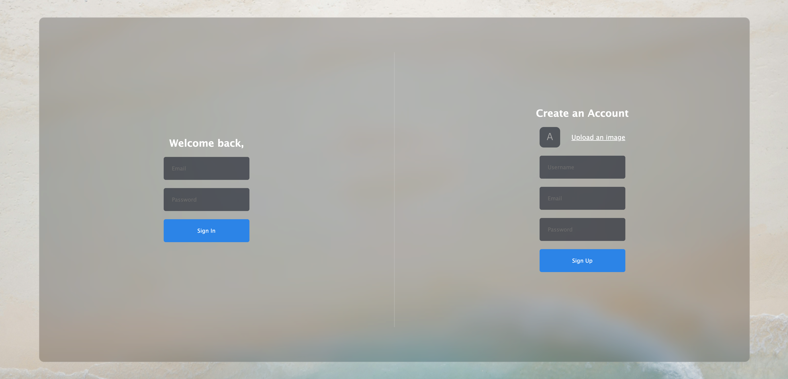

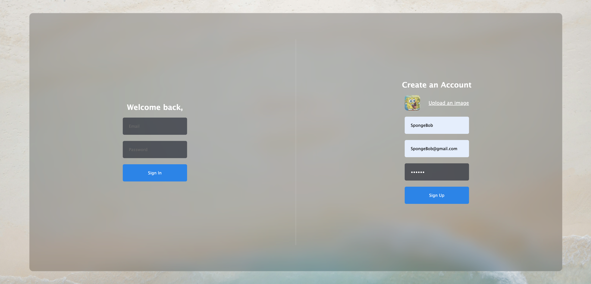

* **User Registration**: Create an account easily by uploading an image and providing your username, email, and password.

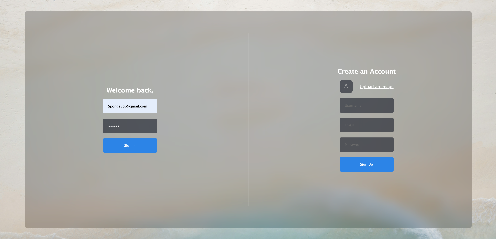

* **Login Page**: Access your account with your credentials after registration.

## After Login

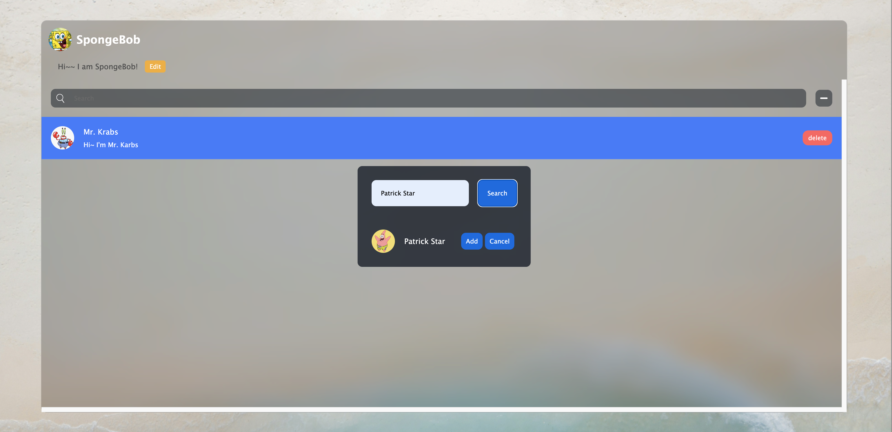

Once you log in, you will see your profile picture and username displayed prominently at the top of the chat interface. Below your username, there is a status message section.

- **Status Message**: You can update your status message at any time by clicking on the "Edit" button. This allows you to share your current mood or activity with your friends.
- **Search Bar**: Use the search bar to find other users within the current chat window. This makes it easy to connect with friends or colleagues.
- **Add New Users**: To add new users, simply click the "+" sign. A search interface will appear, allowing you to find and add new friends to your chat list.

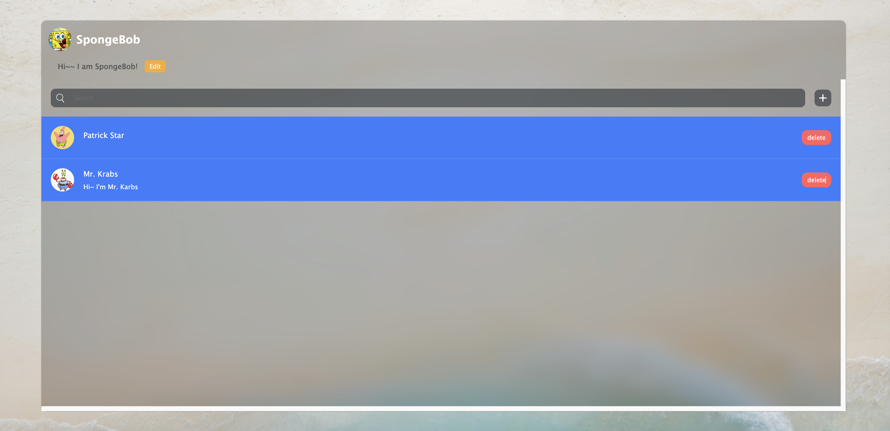

## After Adding Users

Once you add another user, their chat window will open automatically. In this chat window, you will see the other user's profile picture and their current status message displayed prominently.

- **Chat Window**: Engage in conversations with your friends in the chat window, where you can send messages, emojis, and images.

### Sharing Features

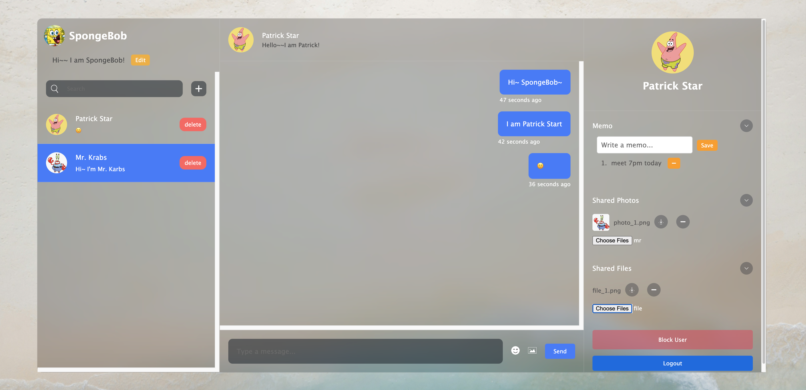

- **Important Notes and File Sharing**: On the right side of the chat window, you will find options for:

  - **Memos**: Take notes about important topics or reminders during your conversations.
  - **Shared Photos**: Share images directly with your chat partner.
  - **Shared Files**: Upload and share files relevant to your discussions.

### File Management

You can manage shared content easily:

- **Download**: Download any shared files or photos to your device.
- **Delete**: Remove any shared items if they are no longer needed, keeping your chat organized.

## Logging Out and Switching Users

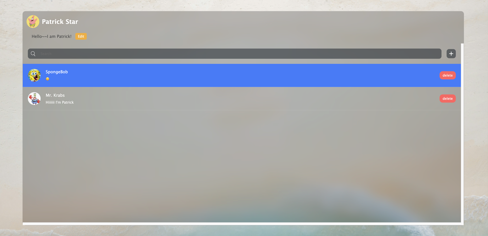

If you log out and then log in as another user, such as Patrick Star, a new chat window will open for your conversations with SpongeBob.

### Unread Messages Indicator

- **New Chat Window**: Each time you start a conversation with a different user, a new chat window will be created.
- **Unread Messages**: Any new conversations or chats that you haven't checked yet will be highlighted in blue. This visual cue helps you easily identify messages that require your attention.

## Chat History

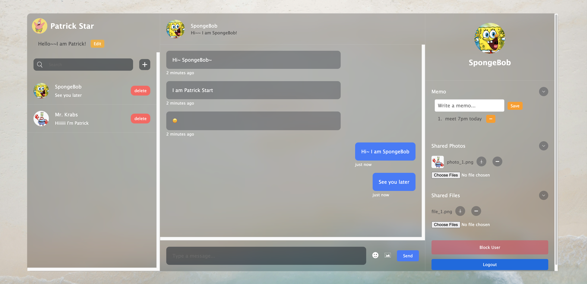

When you click on a chat, you will find all the previous conversations, memos, photos, and files associated with that user. This allows you to easily revisit important discussions and shared content.

**Chat Content**: All your past messages, notes, images, and files will be displayed in the chat history, providing a comprehensive view of your interactions.

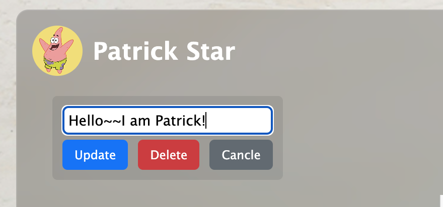

* **Edit Status Message**: You can also change your status message from this chat view by clicking the "Edit" button, allowing you to keep your friends updated on your current mood or activity.

## User Blocking

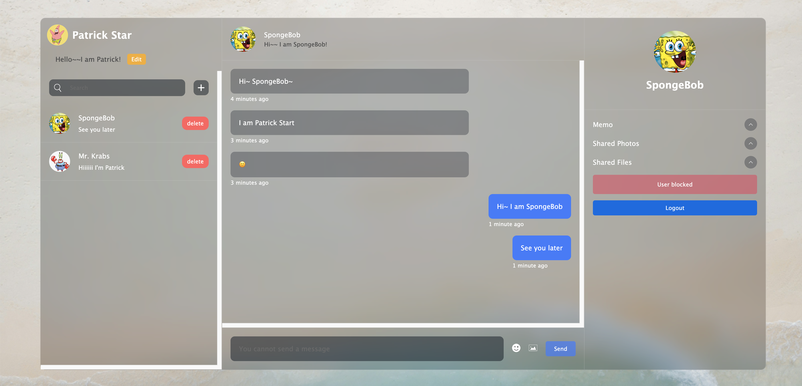

If you choose to block a user, their status will change to "Block User". This action prevents any further communication with that user.

* **Blocking a User**: When you click on "Block User," the blocked user will be unable to send you messages. In the chat window, you will see a notification stating, "You cannot send a message," indicating that communication is no longer possible.

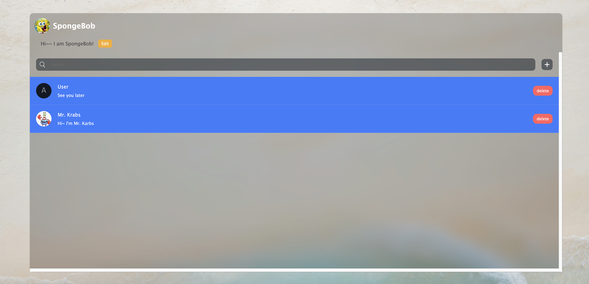

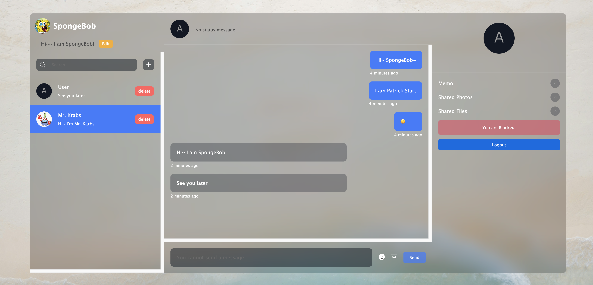

* **Login as Blocked User**: If you log in as the blocked user, you will not see their profile picture or status message. Instead, a message will appear saying, "You are Blocked!" This reinforces that you cannot send messages to the user who has blocked you.

## Conclusion

Thank you for exploring **chatWith**! We designed this application to provide you with a seamless and enjoyable chatting experience. From user-friendly features to efficient communication tools, our goal is to enhance your conversations and help you connect with friends and colleagues effortlessly.

Whether you're sharing moments, exchanging files, or simply catching up, **chatWith** is here to support your communication needs. We hope you enjoy using the website and look forward to your feedback and suggestions for future improvements.

Happy chatting!
